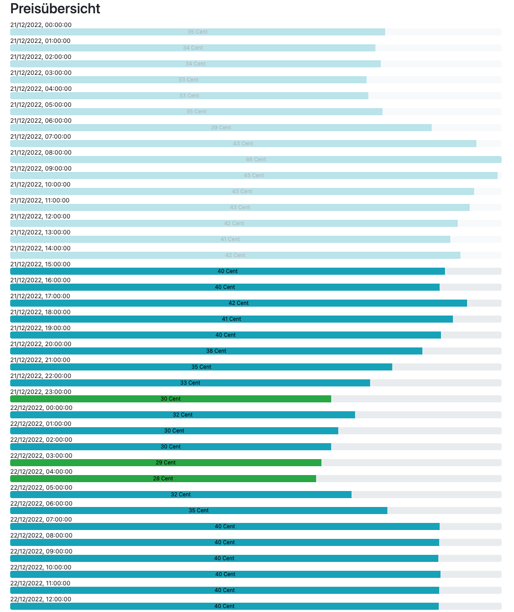
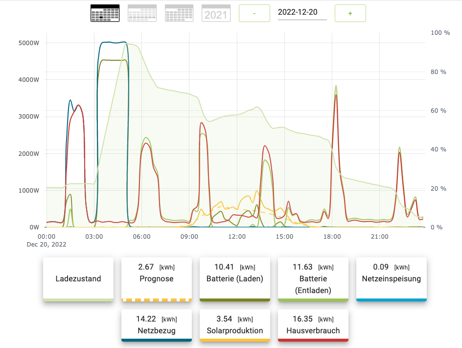

# e3dc grid charge in a Docker image

## Aim of this fork
Take the project from https://github.com/moritzmair/e3dc_grid_charge and package it in a container to run

## Setup
- take config.json.example as a template and fill in your values
- mount the config.json file to /usr/src/app/config.json
  ```bash
  docker run -d --name e3dc_grid_charge -v /path/to/config.json:/usr/src/app/config.json:ro --restart unless-stopped --network host lumoc/e3dc-tibber:latest
  ```
## Original README
### What is this about?

This will get prices from the tibber api, find out the cheapest hours and charge an E3 DC battey storage system via
e3dc rscp protocol mainly based on https://github.com/git-kick/ioBroker.e3dc-rscp

The idea is to use energy when it is cheaply available and not beeing needed by most people on the energy grid.
As prices on the epex spot market are released at about 13:00 this software will ask for the day ahead prices at about 14:00 and search for the x cheapest hours for the next 24 hours.
The prices and the selected hours can be viewed with a webserver on port 8080 -> http://localhost:8080/

Be careful with this, this is a very early version. If you plan to use this be sure you know what you are doing.

Web interface showing one day in december 2022


Typical day where grid charging has been active for 2 hours in the night


If you want to get in touch with me, just message me on Telegram:
[@Master92](https://t.me/Master92) 🇩🇪🇬🇧

#### Where to get your tibber token?
* https://developer.tibber.com/
#### Where to get your tibber home id?
* https://developer.tibber.com/explorer
use the following request parameters to get all home id's and the according addresses
```
{
  viewer {
    homes {
      id
      address {
        address1
        postalCode
        city
      }
    }
  }
}
```
#### Where to set the rscp password?
* on your E3DC touch panel under personalize > user profile > scroll down

## Found a bug/need a feature?
Please use the Issue tracker on github